# Project System & Architecture Summary

This document provides a structured, high-density system summary optimized for AI agents and developers. It defines the architecture, features, database schema, and key node dependencies of **Sistem Web Desa Munungkerep**.

---

## 1. System Specifications & Tech Stack
* **Framework**: Laravel 11/12/13 (MVC architecture).
* **Language**: PHP 8.4+ (Strict typing, strong regex validation).
* **Database**: SQLite/MySQL (Managed via Eloquent ORM).
* **Frontend**: HTML5, Vanilla JS (ES6+), Blade Templates, CSS Custom Properties (CSS variables).
* **External Libs**: Leaflet.js (Map), Quill.js (Rich Text), heic2any (Client-side HEIC decoder).

---

## 2. Key Architecture Nodes

```mermaid
graph TD
    %% Entrypoints & Core
    WebRoutes[routes/web.php] --> AuthMiddleware[Auth Middleware]
    WebRoutes --> PublicRoutes[Public Pages]

    %% Public Views & Logic
    PublicRoutes --> BerandaBlade[views/beranda.blade.php]
    PublicRoutes --> HomeBlade[views/home.blade.php: Map & Potensi]
    
    %% Controllers (CMS)
    AuthMiddleware --> AdminDashboard[AdminDashboardController]
    AuthMiddleware --> AdminUser[AdminUserController]
    AuthMiddleware --> AdminSetting[AdminSettingController]
    AuthMiddleware --> AdminMedia[AdminMediaController]
    AuthMiddleware --> AdminBerita[AdminBeritaController]
    AuthMiddleware --> AdminKegiatan[AdminKegiatanController]
    
    %% Helper
    AdminSetting & AdminMedia & AdminBerita & AdminKegiatan --> ImageHelper[App/Helpers/ImageHelper.php]
    
    %% Modular Settings Views (CMS)
    AdminSetting --> BerandaSetting[views/admin/pengaturan/beranda.blade.php]
    AdminSetting --> ApbdesSetting[views/admin/pengaturan/apbdes.blade.php]
    AdminSetting --> DemografiSetting[views/admin/pengaturan/demografi.blade.php]
    AdminSetting --> PotensiSetting[views/admin/pengaturan/potensi.blade.php]
    AdminSetting --> PerangkatSetting[views/admin/pengaturan/perangkat.blade.php]
    AdminMedia --> MediaBlade[views/admin/media.blade.php]
    AdminDashboard --> DashboardBlade[views/admin/dashboard.blade.php]
    
    %% Models & Storage
    AdminSetting & BerandaBlade & HomeBlade --> SettingModel[Models/Setting.php]
    SettingModel --> SettingsTable[(Settings DB Table)]
    ImageHelper --> DiskStorage[storage/app/public]
```



---

## 3. Core Database Tables & Settings Map

### 3.1. Main Tables
* **`users`**: Contains system operators. Fields: `id`, `name`, `username`, `email` (strict regex format checks), `password` (hashed), `role` (`admin`/`operator`), `remember_token`, timestamps.
* **`settings`**: Dynamic key-value store for homepage & config. Fields: `id`, `key` (unique string), `value` (nullable text), timestamps.
* **`beritas`**: News articles. Fields: `id`, `judul`, `kategori`, `tanggal`, `foto`, `isi` (HTML from Quill), `views` (integer), timestamps.
* **`kegiatans`**: Activities gallery. Fields: `id`, `judul`, `kategori`, `tanggal`, `lokasi`, `nama_pembuat`, `foto`, `deskripsi`, timestamps.
* **`produks`**: Local products catalog. Fields: `id`, `nama`, `harga`, `kontak`, `foto`, `deskripsi`, timestamps.

### 3.2. Settings Table Key Register
* **`hero_slide_1`** to **`hero_slide_4`**: Full URLs to slider background WebP images.
* **`tentang_p1`** to **`tentang_p3`**: Standard paragraphs representing the village description.
* **`layanan_cards`**: JSON array of 6 cards. Struct: `[{title, desc, link, icon: raw SVG text}]`.
* **`data_potensi`**: JSON object containing partitioned village economy potentials.
  * *Keys*: `tembakau`, `pandan`, `padi`.
  * *Structure*: 
    ```json
    {
      "tag": "String tag label",
      "judul": "Commodity Title",
      "foto": ["URL array"],
      "isi": "Full description paragraph",
      "manfaat": ["Bullet points array"],
      "catatan": "Optional developer notes",
      "produk": ["Olahan product chips array"],
      "cara": ["Step-by-step processing guide array"]
    }
    ```

---

## 4. Key Functional Implementations & Client-Side Logic

### 4.1. Client-Side Image Compressor & HEIC Decoder
* **File**: [views/layouts/admin.blade.php](resources/views/layouts/admin.blade.php)
* **Logic Flow**:
  1. Form `submit` event listener intercepts all image uploads.
  2. If file size > 1.5MB or format is HEIC/HEIF:
     * Triggers `heic2any` library to convert HEIC -> JPEG in the browser.
     * Uses HTML5 `<canvas>` to resize width/height to max 1600px.
     * Outputs to JPEG at 75% quality.
     * Replaces the file input value using `DataTransfer` API.
  3. Bypasses PHP `post_max_size` (usually 2MB/8MB) limitations by reducing multi-megabyte raw photos to optimized ~300KB-800KB files on client devices.
  4. Explicitly synchronizes Quill rich text content to `#isi-input` hidden fields *before* triggering final `form.submit()`.

### 4.2. Infinite Loop Carousel & Popups
* **File**: [views/home.blade.php](resources/views/home.blade.php) (Peta & Potensi page).
* **Structure**: `.potensi-carousel-wrap` contains `.potensi-track` containing cards.
* **Infinite Loop Logic**:
  * Original 3 cards are cloned at both the start and end of the `.potensi-track` (total 9 nodes).
  * JavaScript tracks the current index.
  * Transitions are controlled via CSS `transform: translateX()`.
  * Upon reaching boundary conditions (`currentIndex >= totalOri * 2` or `< totalOri`), the track dynamically performs a **zero-transition offset teleport** back to the corresponding original set, creating an uninterrupted loop belt.
  * Navigation is synced to `.potensi-dots` using modulo math: `currentIndex % totalOri`.
  * Fully supports: auto-play every 4 seconds, manual desktop cursor dragging (grabbing), touch swipes on mobile devices, and navigation arrows.
* **Modal Popup Animation**:
  * Uses `cubic-bezier(0.34, 1.56, 0.64, 1)` transition for an elastic scale bounce (`scale(0.9) translateY(20px)` to `scale(1) translateY(0)`) when opening card detail popup.

### 4.3. Rich Text Image URL Paste Interceptor
* **Files**: [views/admin/berita/create.blade.php](resources/views/admin/berita/create.blade.php), [views/admin/berita/edit.blade.php](resources/views/admin/berita/edit.blade.php)
* **Logic**: Uses a custom Quill Clipboard matcher `quill.clipboard.addMatcher(Node.TEXT_NODE, ...)` that intercepts pasted strings. If the text matches an image URL regex ending in standard extensions, it automatically converts the pasted plain text into an inline HTML `` embed.
* **Frontend Rendering**: [views/beranda.blade.php](resources/views/beranda.blade.php) utilizes dynamic regex parsing to convert Markdown image tags `` and standalone image URL paragraphs in the body into structured HTML tags, while stripping them from the card previews.

---

## 5. Important Maintenance Commands & Gotchas

* **View Cache Conflicts**: When editing Blade scripts containing complex JS, stale templates can trigger `SyntaxError`. Proactively run:
  ```bash
  php artisan view:clear
  ```
* **Post Size Fail-safes**: If a user uploads files bypassing JS compression, `ValidatePostSize` middleware triggers a `PostTooLargeException`. This is intercepted inside [bootstrap/app.php](bootstrap/app.php) and redirects back with a friendly alert instead of crashing.
* **Storage Symlink**: Uploaded images are stored in `storage/app/public/`. Ensure the public symlink is active:
  ```bash
  php artisan storage:link
  ```
* **Double Form Submissions**: Avoid binding raw `submit` triggers without checking `form.dataset.compressed` flags, as it will bypass the compressor and double-submit.
