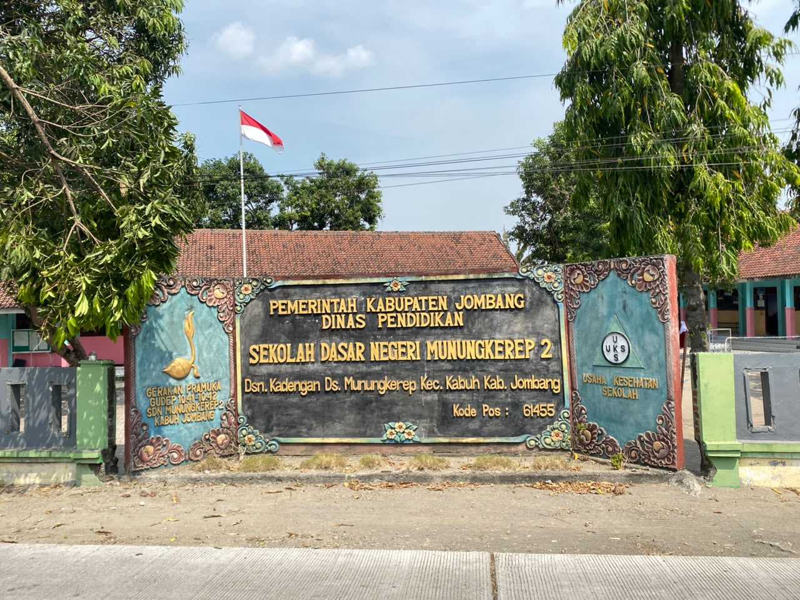

# 🌾 Sistem Informasi & Portal Web Desa Munungkerep

<p align="center">
  
</p>

<p align="center">
  <a href="https://laravel.com"></a>
  <a href="https://php.net"></a>
  <a href="https://leafletjs.com"></a>
  <a href="https://quilljs.com"></a>
  <a href="LICENSE"></a>
</p>

---

## 📌 Tentang Proyek

**Sistem Informasi & Profil Web Desa Munungkerep** adalah platform digital terpadu untuk Pemerintah Desa Munungkerep, Kecamatan Kabuh, Kabupaten Jombang, Jawa Timur. Website ini dibangun untuk mewujudkan tata kelola desa yang transparan, modern, dan informatif melalui publikasi data kependudukan (demografi), transparansi anggaran APBDes, potensi ekonomi komoditas lokal, etalase UMKM warga, rilis berita kegiatan, serta panduan layanan administrasi surat-menyurat desa.

---

## ✨ Fitur-Fitur Utama

### 🌐 1. Portal Publik Interaktif
* **Dynamic Hero Slider**: Slider beranda responsif yang dapat ditambah/dikurangi dan dikelola langsung melalui CMS.
* **Kartu Layanan & Informasi Desa (6 Portal)**: Informasi alur administrasi dan persyaratan pembuatan surat desa (KTP, KK, Domisili, Usaha, Keterangan Tidak Mampu) dengan modal interaktif.
* **Transparansi APBDes**: Infografis anggaran desa real-time (Pendapatan PAD, Dana Desa, ADD, Bagi Hasil Pajak, Bantuan Keuangan) dengan navigasi multi-tahun.
* **Potensi Ekonomi & Infinite Carousel**: Menampilkan komoditas unggulan desa (Tembakau, Daun Pandan, Padi) dilengkapi peta lokasi komoditas interaktif, panduan olahan produk, dan modal pop-up detail.
* **Demografi & Monografi Kependudukan**: Statistik jumlah penduduk, rasio gender, kepala keluarga, luas wilayah, serta batas geografis desa.
* **Bagan Struktur Perangkat Desa**: Menampilkan foto, nama, dan jabatan pamong desa.
* **Rilis Berita Desa & Single-Page Reader**: Membaca artikel berita desa secara instan tanpa reload, dilengkapi pelacakan jumlah tayang (*views counter*).
* **Proteksi Pembaca Aktif (*Active Reader Protection*)**: Jika administrator mengarsipkan/menyembunyikan suatu berita saat pengunjung sedang membacanya, sistem secara otomatis memberikan notifikasi dan mengalihkan pembaca kembali ke beranda.
* **Galeri Dokumentasi Kegiatan**: Dokumentasi foto kegiatan masyarakat dan kepemudaan desa.
* **Etalase Produk UMKM Warga**: Katalog produk lokal hasil kreasi warga desa yang terhubung langsung ke WhatsApp penjual untuk pemesanan.

---

### 🛠️ 2. Panel Pengelola CMS (Admin Dashboard)
* **Segmentasi Hak Akses (Role-Based Access Control)**:
  * **👑 Administrator Desa**: Akses penuh ke seluruh pengaturan desa (Beranda, APBDes, Demografi, Potensi, Struktur Organisasi Perangkat, dan Manajemen User).
  * **✍️ Kontributor / Pemuda Desa**: Akses khusus untuk membuat dan mengelola Berita Desa, Galeri Kegiatan, Produk UMKM, dan Pustaka Media. Menu pengaturan monografi & kelola user diproteksi secara otomatis via middleware.
* **Proteksi Hapus Konten**: Kontributor hanya diizinkan menghapus konten buatannya sendiri, sementara konten resmi desa atau buatan Administrator diproteksi dari penghapusan.
* **Toggle Visibilitas Konten Instan (AJAX)**: Administrator dapat menyembunyikan (*hide*) atau menayangkan (*unhide*) berita, kegiatan, dan produk UMKM dalam 1 klik tanpa reload halaman.
* **Pustaka Media & Universal Media Picker**: Pengelola dapat mengunggah file media sekali dan memilihnya langsung dari modal pop-up di semua form tanpa perlu mengunggah ulang file yang sama.
* **Client-Side Image Compressor & HEIC Converter**:
  * Mengonversi foto format iPhone (`.heic`/`.heif`) menjadi JPEG langsung di browser.
  * Mengompresi resolusi dan ukuran gambar sebelum dikirim ke server, sehingga menghemat kuota, mempercepat waktu upload, dan mencegah *crash* akibat limit upload server (*post_max_size*).
* **Perlindungan Retensi Media (*Safe Retention*)**: Menghapus konten tidak akan menghapus file fisik di Pustaka Media secara tidak sengaja.

---

## 🚀 Arsitektur & Teknologi

| Komponen | Teknologi | Deskripsi |
| :--- | :--- | :--- |
| **Backend** | Laravel (PHP 8.2+) | MVC Architecture, Middleware Protection, Eloquent ORM, Storage API |
| **Database** | SQLite / MySQL | Relational schema with foreign keys & dynamic key-value settings |
| **Styling** | Vanilla CSS3 | Custom Design System, CSS Variables, Glassmorphism, Micro-animations |
| **Interaktivitas** | Vanilla JavaScript (ES6+) | Asynchronous AJAX Fetch, DOM Manipulation, Canvas Image Compressor |
| **Peta Interaktif** | Leaflet.js & OpenStreetMap | Visualisasi batas wilayah, fasilitas umum, dan sebaran potensi ekonomi |
| **Rich Text Editor** | Quill.js | Format penulisan berita, list, kutipan, dan penyematan gambar artikel |
| **HEIC Decoder** | `heic2any` | Konversi otomatis format foto Apple HEIC di sisi browser |

---

## 📂 Struktur Direktori Utama

```text
sistem-web-desa/
├── app/
│   ├── Helpers/
│   │   └── ImageHelper.php          # Kompresi & manajemen berkas gambar
│   ├── Http/
│   │   ├── Controllers/             # Controller Publik & CMS Admin
│   │   └── Middleware/
│   │       └── EnsureUserIsAdmin.php# Proteksi hak akses role Administrator
│   └── Models/                      # Model Eloquent (Berita, Kegiatan, Produk, User, Setting)
├── database/
│   ├── migrations/                  # Skema database & penambahan role/user_id/is_hidden
│   └── seeders/                     # Seeder data awal berita & demo
├── public/                          # Aset statis (CSS, JS, Ikon, Gambar slider)
├── resources/
│   └── views/
│       ├── admin/                   # Template CRUD CMS Admin (Berita, Kegiatan, Produk, Pengaturan, User)
│       ├── layouts/                 # Layout Master Blade (Admin & Web Publik)
│       ├── beranda.blade.php        # Halaman utama portal desa & single-page reader
│       ├── kegiatan.blade.php       # Halaman galeri kegiatan
│       ├── produk.blade.php         # Halaman etalase produk UMKM
│       └── profil-desa.blade.php    # Halaman profil & monografi desa
└── routes/
    └── web.php                      # Definisi rute publik, API status, dan CMS Admin
```

---

## 💻 Panduan Instalasi & Menjalankan

Ikuti langkah-langkah berikut untuk menjalankan sistem di komputer lokal (*Local Development*):

### 1. Prasyarat Sistem
* PHP >= 8.2 (dengan ekstensi `pdo`, `mbstring`, `openssl`, `gd` / `imagick`, `fileinfo`)
* Composer >= 2.x
* Web Server (Apache/Nginx) atau PHP Built-in Server

### 2. Kloning Repositori
```bash
git clone https://github.com/frizzz-cy/sistem-web-desa.git
cd sistem-web-desa
```

### 3. Pasang Dependensi Composer
```bash
composer install
```

### 4. Konfigurasi Lingkungan (`.env`)
Salin berkas template `.env.example` menjadi `.env`:
```bash
cp .env.example .env
```
Sesuaikan konfigurasi database Anda pada `.env` (secara default menggunakan SQLite atau MySQL).

### 5. Generate Application Key & Symlink Storage
```bash
php artisan key:generate
php artisan storage:link
```

### 6. Migrasi Database & Seeder
Jalankan migrasi tabel database:
```bash
php artisan migrate
```
*(Opsional)* Jalankan seeder berita awal:
```bash
php artisan db:seed --class=BeritaSeeder
```

### 7. Jalankan Server Lokal
```bash
php artisan serve
```
Buka browser dan akses alamat:
* **Halaman Publik**: `http://localhost:8000`
* **Halaman Login Admin**: `http://localhost:8000/login`

---

## 👥 Pengguna & Hak Akses

| Peran (*Role*) | Hak Akses (*Privileges*) |
| :--- | :--- |
| **👑 Administrator** | Memiliki wewenang penuh atas seluruh website: Pengaturan Beranda, APBDes, Demografi, Potensi, Struktur Perangkat, Kelola Akun Pengguna, Visibilitas Konten (*Hide/Unhide*), serta Hapus Konten. |
| **✍️ Kontributor** | Dikhususkan untuk pemuda/karang taruna desa untuk mengunggah Berita Desa, Dokumentasi Kegiatan, Produk UMKM, dan Pustaka Media. Tidak memiliki akses ke pengaturan anggaran/monografi dan hanya bisa menghapus konten buatannya sendiri. |

---

## 📄 Lisensi

Proyek ini dilisensikan di bawah [MIT License](LICENSE). Bebas digunakan, dikembangkan, dan disesuaikan untuk kebutuhan digitalisasi desa.

---

<p align="center">
  <b>Pemerintah Desa Munungkerep</b><br>
  Kecamatan Kabuh, Kabupaten Jombang, Jawa Timur
</p>
